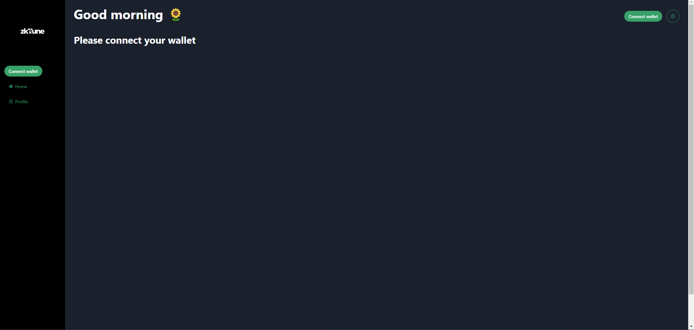
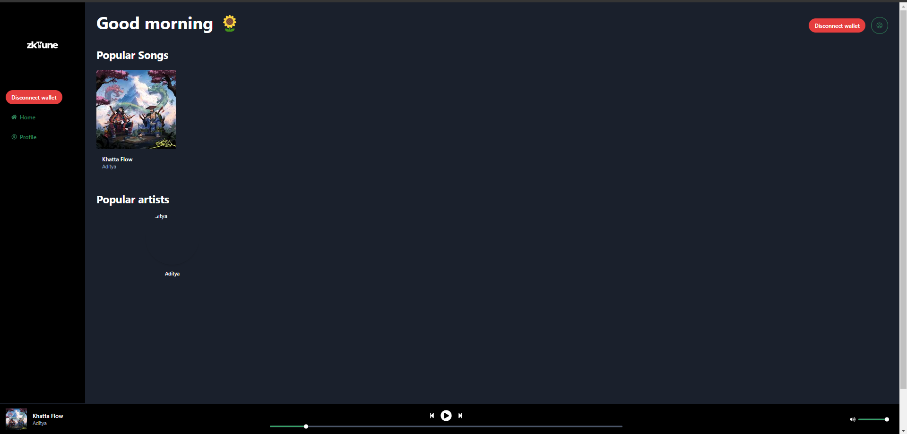

# zkTune: Decentralized Music Streaming with Zero-Knowledge Proofs

## Overview

zkTune is a revolutionary music streaming platform built on blockchain technology. It utilizes zero-knowledge proofs to enable secure and private music streaming while empowering artists and fostering a fairer music ecosystem.




## Key Features

* **Decentralized:** Eliminates the need for intermediaries, allowing direct interaction between artists and fans.
* **Zero-Knowledge Proofs:** Ensures privacy by verifying payment without revealing users' listening habits.
* **Artist Empowerment:** Provides artists with greater control over their music and the ability to earn directly from fans.
* **Transparent Transactions:** Blockchain technology offers secure and transparent transaction tracking.
* **Rich Music Library:** Explore a vast collection of music from independent and established artists.

## How it Works

1. **User Registration:** Users create accounts on the zkTune platform.
2. **Music Streaming:** Users search for music and stream their favorite tracks.
3. **Micropayments:** Zero-knowledge proofs verify payments without revealing specific listening details. This protects user privacy while ensuring artists receive compensation.
4. **Smart Contracts:** Securely manage payments and artist royalties through self-executing smart contracts.
5. **Content Distribution:** Music files are stored securely using decentralized storage solutions (e.g., IPFS, Pinata).

## Benefits for Artists

* **Direct Revenue Sharing:** Earn directly from fans without platform deductions.
* **Fair Compensation:** Transparent royalty distribution based on streamed tracks.
* **Global Reach:** Gain exposure to a wider audience on a decentralized platform.
* **Creative Control:** Maintain complete ownership and control over your music.

## Benefits for Users

* **Privacy-Focused Streaming:** Enjoy music without compromising your listening habits.
* **Direct Support for Artists:** Contribute directly to your favorite artists' success.
* **Transparent Fees:** Understand exactly how your payments are used.
* **Rich Music Discovery:** Explore a diverse range of music from independent talents.

## Technical Stack

* **Blockchain:** zkSync
* **Smart Contract Framework:** Solidity and Hardhat
* **Frontend Framework:** NextJS
* **Backend Database:** Pinata

## Getting Started

* **Prerequisites:** Node.js
* **Installation:** The installation of the application will require further steps:

1. First clone the repository:
   ```bash
   git clone https://github.com/mishraji874/zkTune-Decentralized-Music-Streaming-Platform.git
   ```
2. Install all of the packages of the main application to run the hardhat and compile and deploy the smart contracts:
   ```bash
   npm install
   ```
3. Create a `.env` file and paste your PRIVATE_KEY of the wallet as `WALLET_PRIVATE_KEY`.
4. Then, compile all of the smart contracts using the command given below:
   ```bash
   npx hardhat compile
   ```
5. Now, deploy the smart contracts to the zkSync blockchain by running the deploy command:
   ```bash
   npm run deploy
   ```
6. After successfully deploying the contracts, copy the contract addresses of the `GeneralPaymaster` contract address and also copy the address of the `zkTune` contract address and paste them into the `interface` folder and create a new file named `.env` and paste both the contract addresses and also the `PINATA_API_KEY` and also `PINATA_SECRET_API_KEY` in the following order:
   ```bash
    NEXT_PUBLIC_ZK_TUNE_ADDRESS = "ZK_TUNE_ADDRESS_goes_here"
    NEXT_PUBLIC_PAYMASTER_ADDRESS = "PAYMASTER_ADDRESS_goes_here"
    NEXT_PUBLIC_PINATA_API_KEY="PINATA_API_KEY_goes_here"
    NEXT_PUBLIC_PINATA_SECRET_API_KEY="PINATA_SECRET_API_KEY_goes_here"
    ```
7. Now, copy all of the ABI's from the folder `artifacts-zk/contracts/` and copy the ABI's of all of the contracts and paste them into the `interface/src/ABI` folder.
8. Now, inside of the `interface` folder install the dependencies using the given command below:
    ```bash
    npm install
    ```
9. After installing all of the dependencies, run the application using the given command below:
    ```bash
    npm run dev
    ```
## Contributing

We welcome contributions from the community! Feel free to submit pull requests or raise issues on the project's GitHub repository.

## Disclaimer:

This project is under active development. The provided information represents the current vision and may be subject to change.

## Additional Resources

* Project Website (if applicable)
* Project GitHub Repository: https://github.com/mishraji874/zkTune-Decentralized-Music-Streaming-Platform